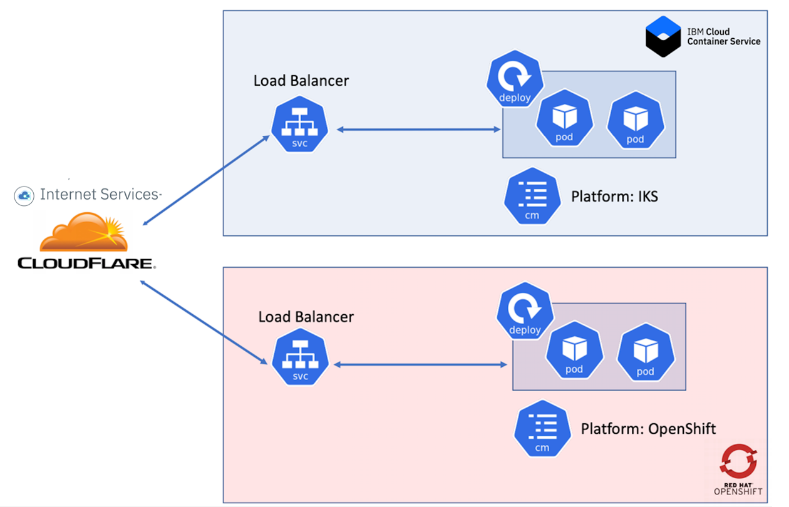

# IBM Internet Services (CloudFlare) Jazz Hands Demo:

Please see the MKDocs GitHub Pages Site for complete documentation on what it takes to build this application and deploy it yourself.  

[https://kriersd.github.io/JazzHands/](https://kriersd.github.io/JazzHands/)

# Working Demo

[http://www.jazzhands-demo.com/](http://www.jazzhands-demo.com/)

The application has been containerized and uploaded to a public Docker repository.

### The Kubernetes artifacts 

* Load Balancer
* Deployment (With 2 replicas for HA)
* ConfigMap

The application is a simple Node.JS application that shows all venue's in a specific area that accepts Bitcoins as payments. The application isn't anything too special, it just allows us to demonstrate the use of IBM's Internete Service (CloudFlare).

All of the artifacts to build this application yourself have been published to this GitHub repository. It should be noted that the instructions do not go into detail on the Kubernetes artifacts or the deployed application. It is assumed that the user has a basic understanding of how to depoy Kuberenetes artifacts. 

# The Demo Environment

We have configured two Kubernetes clusters for this demonstration. Both are currently running in the IBM Public Cloud.

* IKS
* OpenShift - Roks
* IBM Internet Services - CloudFlare

IBM Internet Services (Cloudflare) has been configured to balance the load across both clusters.

# Demo Steps

* Go to the app site. (Your Domain) http://www.jazzhands-demo.com
* You will see the icon in the upper left hand that shows which cluster this page was served from. You will also see a 60 second count down timer. CloudFlare will cache the session for 60 seconds, so any attempts to refresh the page within 60 seconds you will be routed back to the existing cluster. After the 60 second session timeout, it will load balance the next request, which may or may not route you back to the same cluster. Eventually you will see that it will route you to the other cluster. It may take a few trys though.

# What's the point here?

* We are demonstrating the ability to leverage multiple Kubernetes clusters to host your application with the IBM Internet Services (CloudFlare) being the global load balancer to spread the load across these seemingly unrelated clusters. This type of configuration brings a new level of high availability and disaster recovery capabilities to light.  
