#IKS OpenShift CloudFlare DEMO

* Go to cloud.ibm.com login

* Install IBM Cloud CLI's if not already installed

* Download and install a few CLI tools and the Kubernetes Service plug-in.

* ```curl -sL https://ibm.biz/idt-installer | bash```
* Download OpenShift CLI from https://www.okd.io/download.html

##K8's CLUSTER SETUP Navigate to ibmcloud.com Login

* In the Search Bar search for Kubernetes Service
* Select Kubernetes Service
* Select Create Button

* Create IKS cluster type with following attributes: Single Zone tag with jazz Select a location that you want 2 Worker Nodes

* Select the Create Cluster Button

* While that's provisioning, Navigate back to Clusters

* Create OpenShift cluster type with following attributes: Single Zone tag with jazz Select an avaible location 2 Worker Nodes

* Select the Create Cluster Button

##CLUSTER CONTEXT CONFIGURATION 

* Navigate to IBM Cloud Kubernetes CLusters, Select Cluster Go to Access Tab Follow Steps 1 through 4 

* Show kubectl get nodes Command

#Download Git Repo Download 

* https://github.com/kriersd/JazzHands github repo b Unzip and navigate to the yaml dir within the zip

##Apply YAML to Create K8's Objects 

* First going to create the set of objects in IKS to do this

```
kubectl apply -f jazzhands-iks.yaml
kubectl get services
```

* Open a browser and go to the external IP address from the klubectl get services from the loadbalancer service


* Open a seperate terminal/session in order to work with openshift

* Navigate to Kubernetes -> your openshift cluster Go to the Access Tab click

* download OpenShift CLI from

	```
	https://www.okd.io/download.html
	```
	
##Gain access to your cluster

When your cluster is fully deployed, log in to it with your IBMid by using one of the following methods: Browse to the OpenShift console

* In the Upper Right corner select your IAM# and copy the login context for your OpenShift Cluster

Something similar to

```
oc login https://c1-e.us-east.containers.cloud.ibm.com:24341 --token=wwL81E-bOZilW_Un8Czl2fWrwMyWCu_2r4FOjHlQIlE
```

* navigate to the directory that contains jazzhands-openshift.yaml

```
oc apply -f jazzhands-openshift.yaml

oc get services 
```
Make note of the External-IP for the Jazzhands-lb that is output

##DNS SETUP

* Navigate to Hamburger Menu on upper left hand side of screen 

* Navigate to Classic Infrastucture

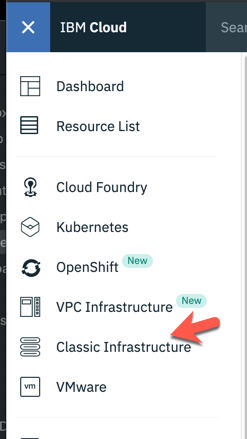

* Within Classic Infastructure drop down on left side Navigate to Services -> Domain Registration

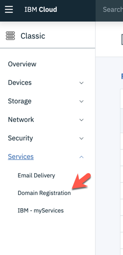

* Once on page select Register

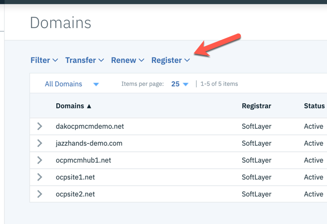

* Input domain name of choice (arbitrary but unique)

* select year(s) for registration

* select Check Availability button

* select Continue button

* Fill in manadatory fields on Complete Registration Page

* Select Order Now button

* Select OK

* You will recieve a validation e-mail from Softlayer in 5 minutes

* In your e-mail there will be a validation link to click.

* While you're waiting for the e-mail navigate back to IBM Cloud and in the search bar at the top of screen input "Internet Services" 


* Select the Internet Services Tile

* Create a Name related to your newly created domain

* Tag the service appropriately for your purposes

* You can select Free Trial or standard as Pricing Plan type

* Select Create Button at bottom of screen

* You have now created a CIS Instance

* On the Internet Services Page

* Navigate to the Lets Get Started Button

* Input newly created domain in Domain name 

* Select Connect and Continue Buttons

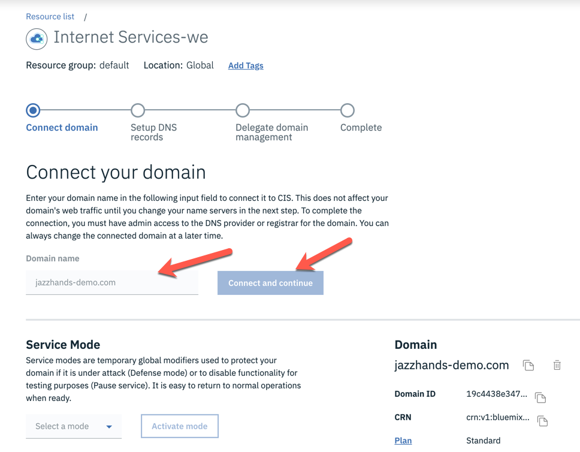

* On the Setup your DNS Records Flow page select Next step button

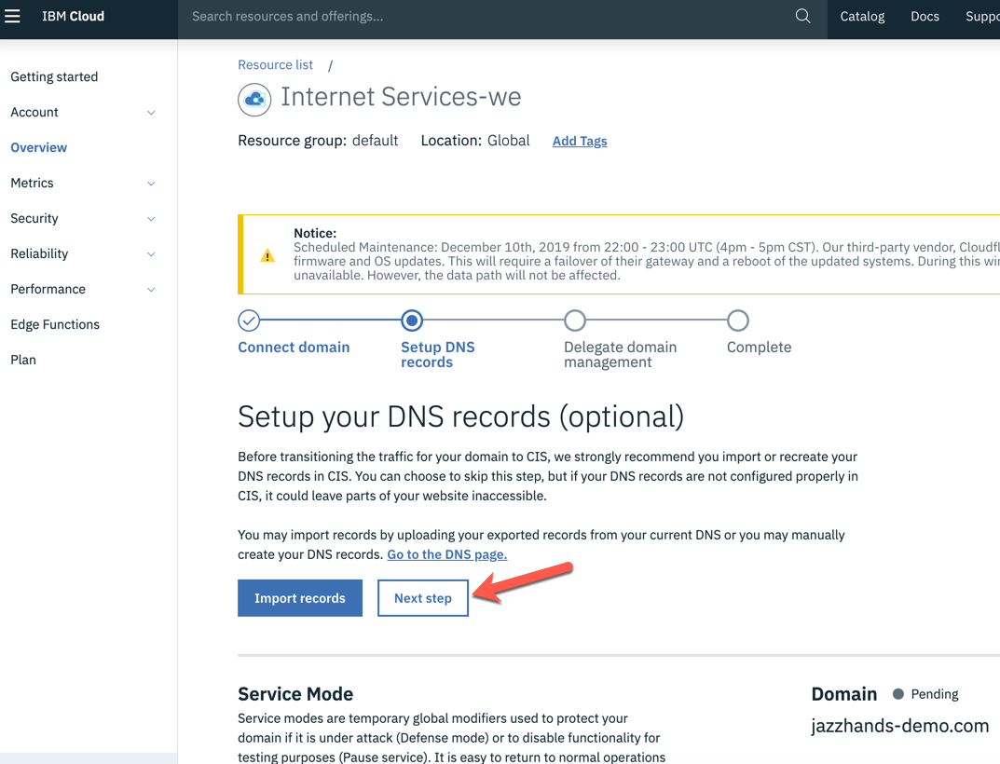

* Make note of the new NS records, you will need to use these later

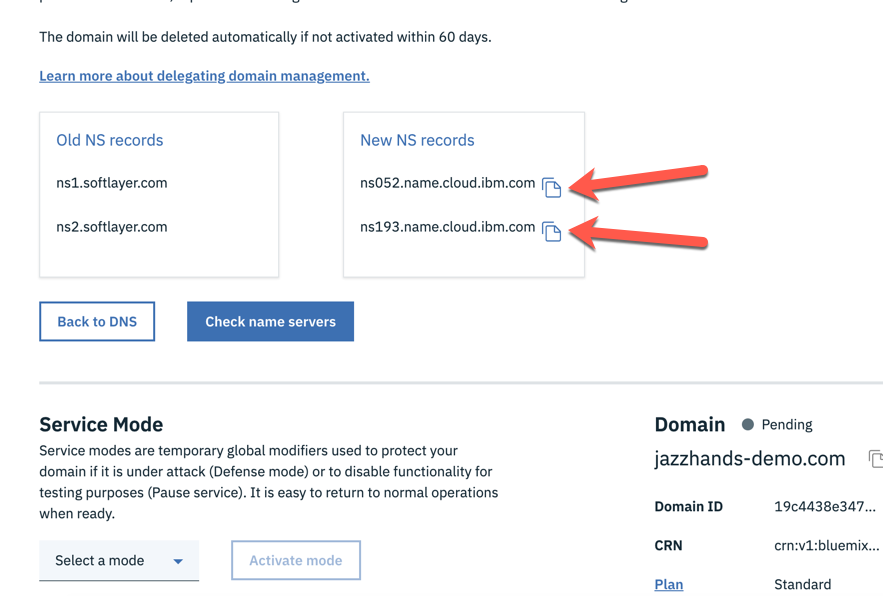

* Open a new tab and Navigate back to Classic Infrastructure within ibmcloud.com

##GLOBAL LOAD BALANCER (CLOUDFLARE) SETUP

* From the hamburger Menu top right Services -> Domain Registration

* change from Locked to Unlocked

* Click the twistie to expand details below your new DNS record

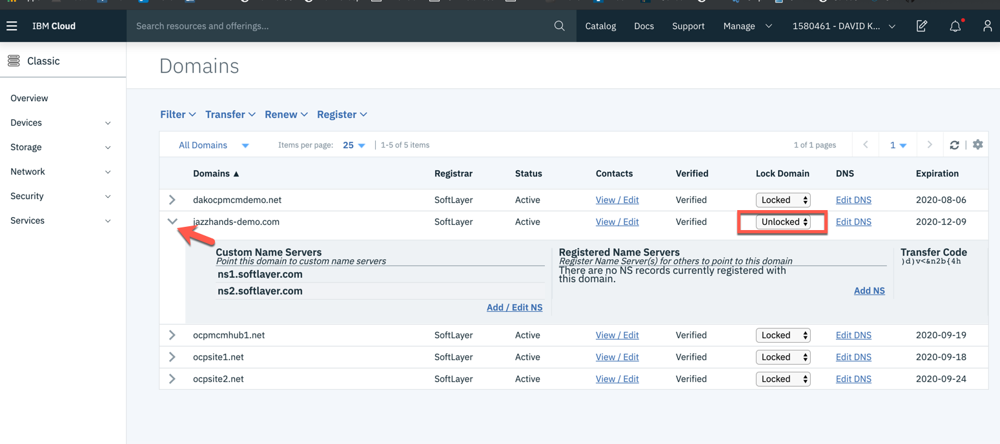

* Update Custom Name Servers

* Select the Add/Edit NS Link

* Replace the existing Name Server Entries with the 2 new entries from your Internet Services 

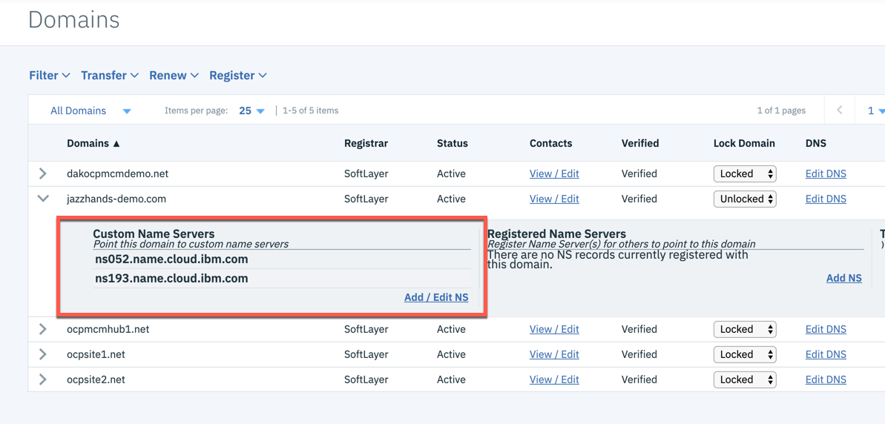

* the New Name servers provided by CIS

* Select the Associate Button

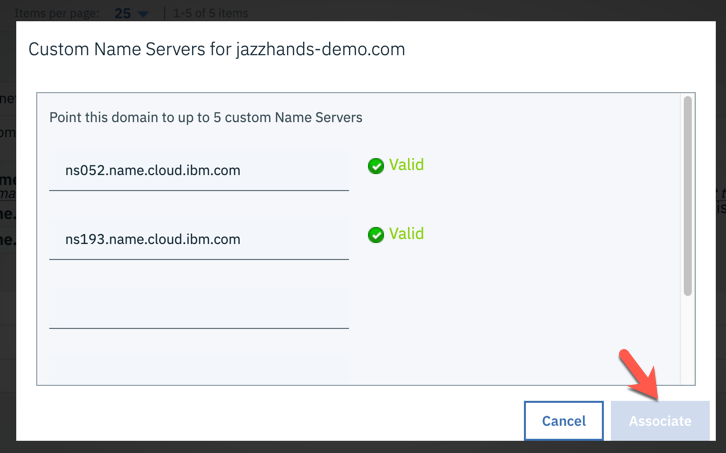

* You'll receive a success verification notification pop up in the top right of the IBM Cloud page Navigate to your CIS Tab

* Within your CIS Management Page, reload the page, verify that your domain is active by noting the green indicator with a state of "Active"

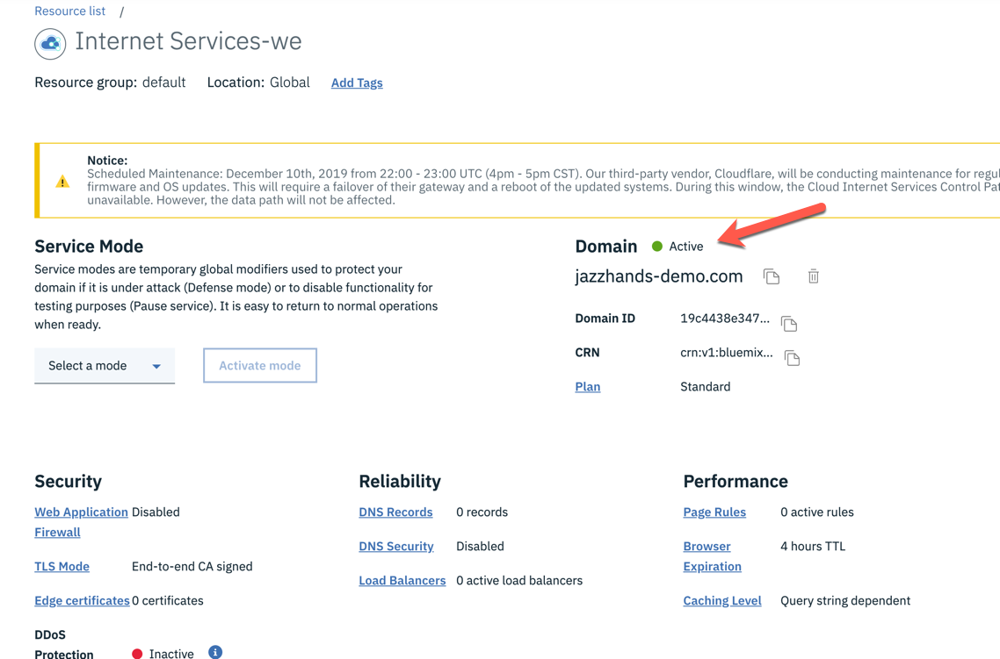

* Scroll to the Load Balancers Link and select the link

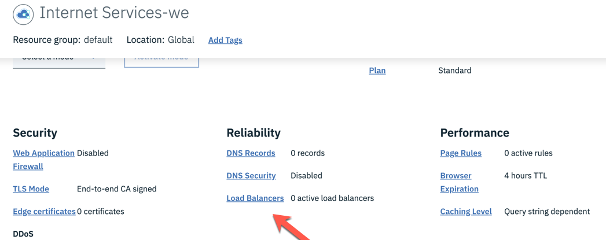

* Scroll to the Origin Pools Section select Create Pool button

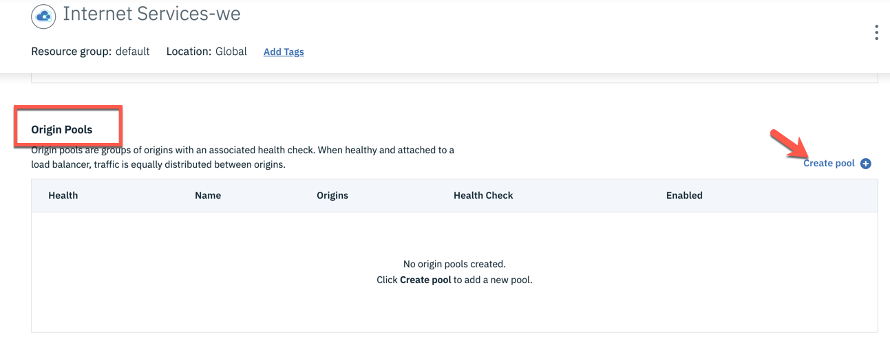

* Input a Pool Name such as JazzHands (no spaces)

* In the Health check section input a "/" and define the port # as 80

* Under Health Check Region, select a region that's nearest your Kubernetes services

* Omit your e-mail (you will thank me later)

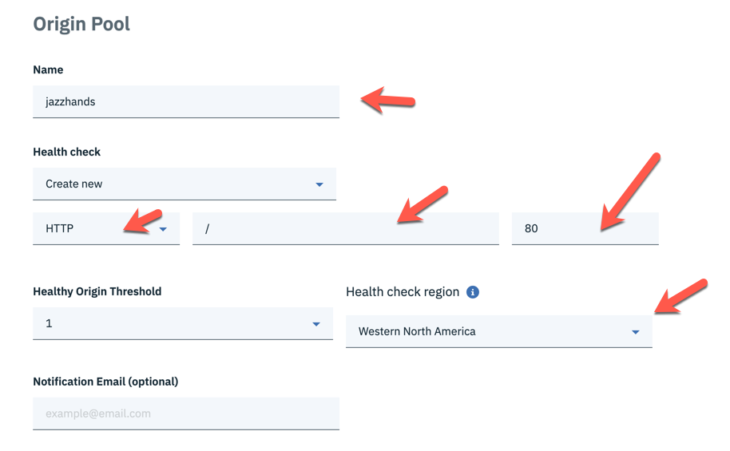

* Scroll to the Origins Section 
* Provide an Origin name and provide the exteral IP address noted previously from the kubectl describe service command 
* Select Enable toggle to right to enable the address

* Click the Add Origin Button up
run the OC get services command and make note of the jazzhands-lb EXTERNAL-IP ip address

* Add and Origin Name and the ip from the get services command 
Select Enable toggle to right to enable the address

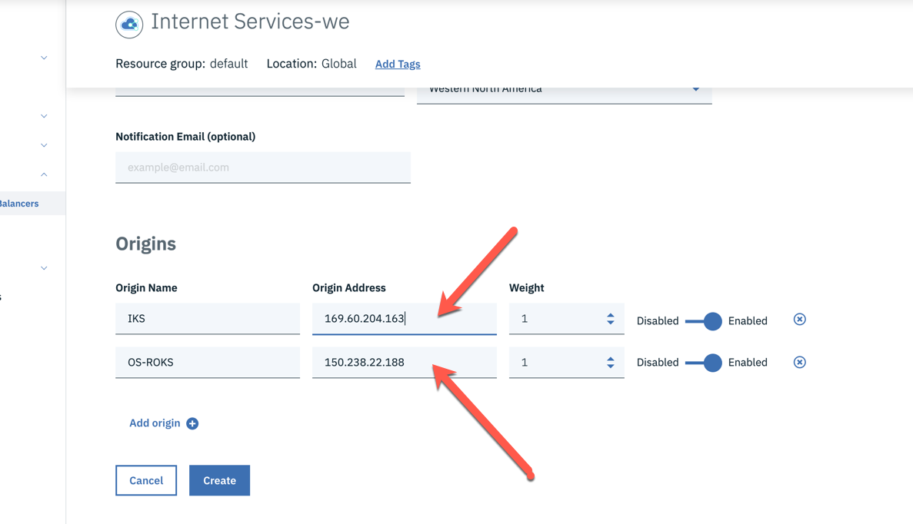

* Finish this set of steps by selecting the Create button

* The Health check will show Critical initially, this is normal and will rectify itself in 1-2 min with a page refresh.

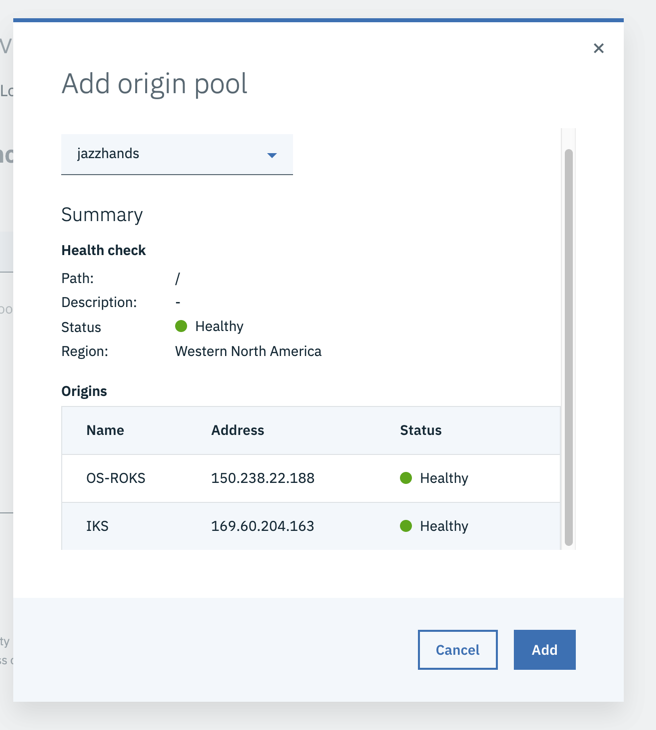

* Scroll to LoadBalancers Section
* Select the Create Load Balancer button
* in the Balancer Hostname field, provide *.yournewdomainname
* Confirm the TTL is 60 seconds

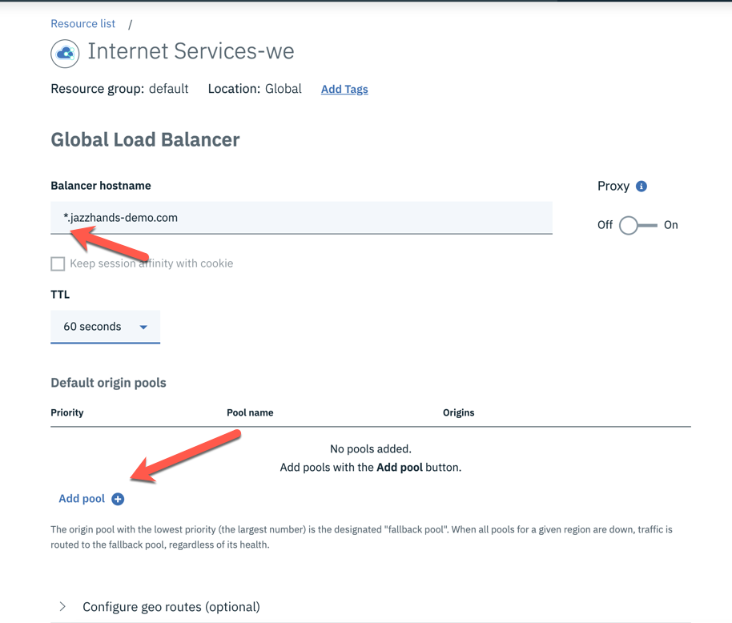

* Scroll down to the Add Pool button and select the Originpool that was just created, click Add

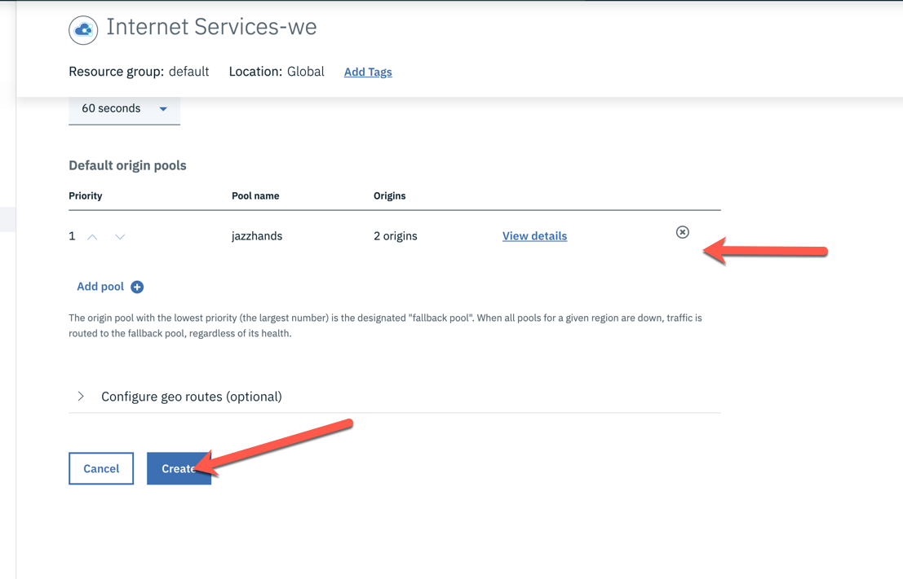

* Select the Create button 

##TEST YOUR SETUP
* Point a browser at the newly created DNS name (http://yournewdomain.com) 
* Note on the upper-left whether you are currently running against IKS or ROKS
* Wait approximately 1 minute (the countdown timer is there to assist)
* Refresh the page
* Observe the change from IKS to ROKS
